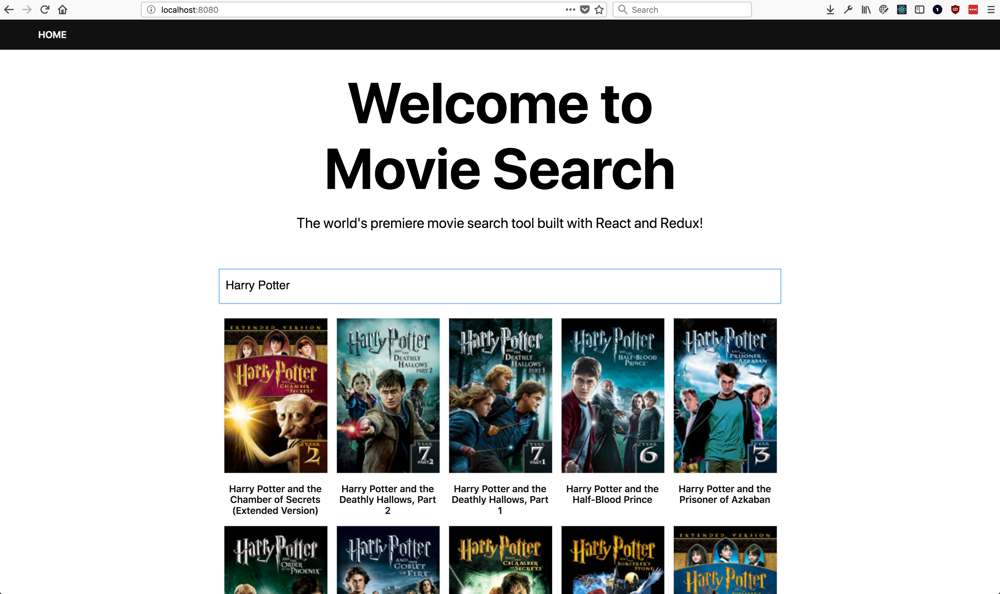

# React & Redux Testing Workshop

An introductory workshop for testing a front-end application built with React, Redux, and redux-little-router using [Jest](https://facebook.github.io/jest/) and [Enzyme](http://airbnb.io/enzyme/).

**Parts**:

- [Action Creators](https://github.com/HipsterBrown/jest-testing-workshop/tree/testing-action-creators/test/actions)
- [Reducers](https://github.com/HipsterBrown/jest-testing-workshop/tree/testing-reducers/test/reducers)
- [Snapshots](https://github.com/HipsterBrown/jest-testing-workshop/tree/testing-snapshots/test/components)
- [Enzyme](https://github.com/HipsterBrown/jest-testing-workshop/tree/testing-enzyme/test/containers)

## Running the example app

The example app uses the [iTunes search API](https://affiliate.itunes.apple.com/resources/documentation/itunes-store-web-service-search-api/) to query for whatever term typed into the search box.

The app was built using Node.js version 8 and npm version 5, so using those versions will allow for the greatest guarantee of running successfully.

Run the following command to setup the application locally:

- `git clone https://github.com/HipsterBrown/jest-testing-workshop.git`
- `npm install`
- `npm start`

Running `npm start` will start a [`webpack-dev-server`](https://webpack.js.org/guides/development/#using-webpack-dev-server) at `localhost:8080` and watch for code changes.

**App Preview:**

## Running the tests

When in one of the `testing-*` branches of this repo, running `npm test` will run any test files in that branch.

To watch for testing changes, run `npm test -- --watch` to pass the `--watch` flag to Jest.

Each branch contains a README in the appropriate testing directory, i.e. the `testing-action-creators` branch contains a README with details about testing Redux action creators under `test/actions/`. 
